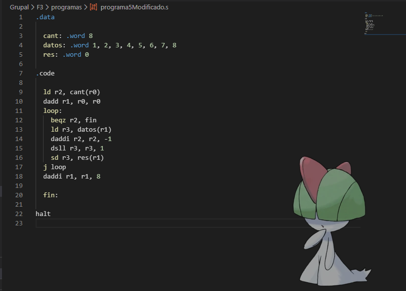
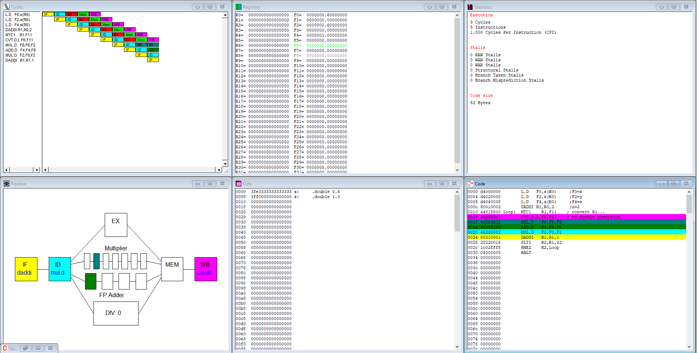
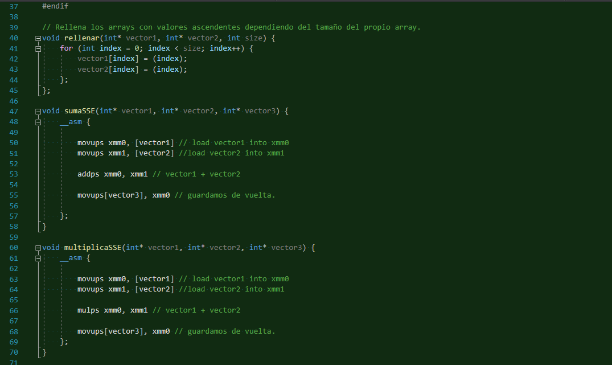

## Study on Computer Architecutres, i8086, MIPS, Programmed Segmentation Control and Enhanced Virtual Addressing.

  </img>
  </img>
  </img>

This repository contains the practicies that i've done during UA's Computer Architectures subject, meant to learn current architecutres as CISC, RISK and types as SISD, SIMD, MISD, MIMD, and also multy-phase segmented architectures.

In this repository you can find:

- A benchmark made in C++.
- A benchmark made with MMX.
- A benchmark made with SEE.
- The SPECCPU2000 benchmark.
- A MIPS64 Simulator.
- A guide that teaches MMX.
- A guide that teaches how MIPS64 works.
- A guide that teaches what and how segmented architecutres work.
- Practices to learn about structural, data and control risks.
- Practices to learn how to solve said risks.
- Medium and Advanced concepts on RISK.
- Advanced condepts on segmented architectures.
