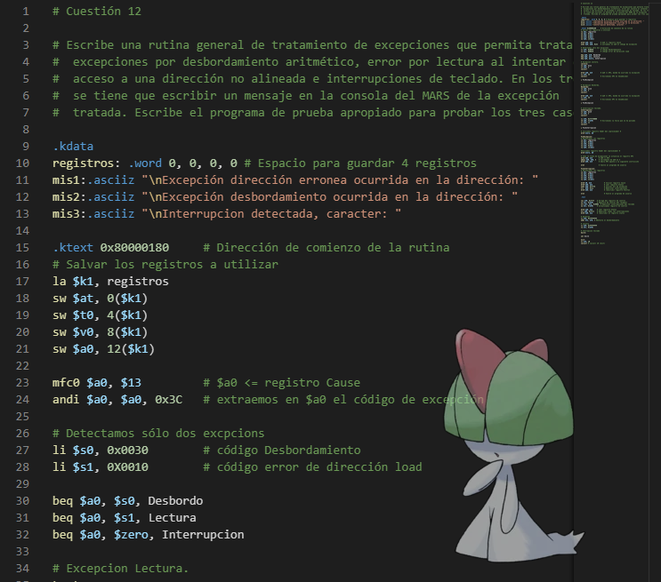
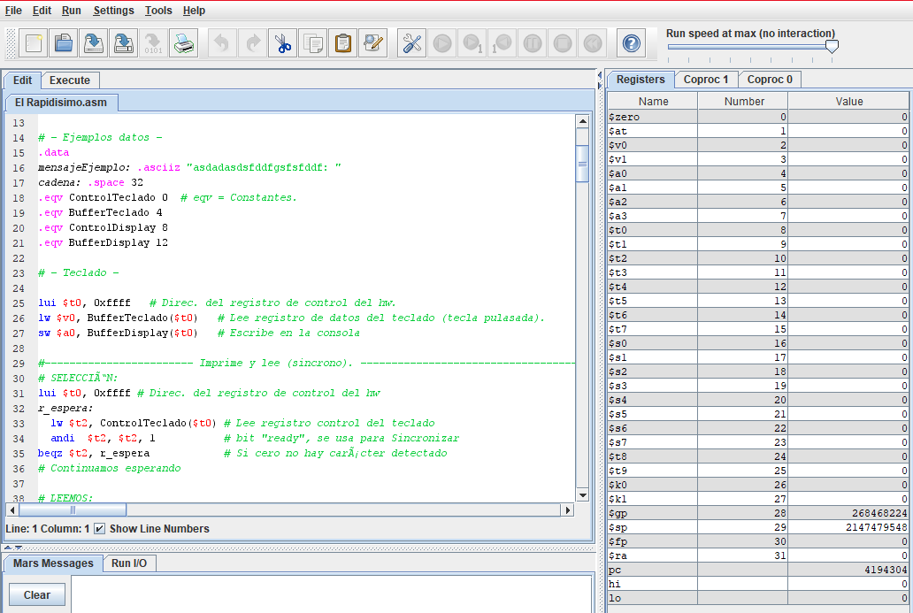

## Computer Structures, Assembly langauge over MIPS.

  </img>
  </img>

This repository contains the exercices that i've done during UA's Computer Structures subject, meant to learn Assembly, using a MIPS processor as platform.

In this scenario, were not going to use a real MIPS processor, but a simulator made with Java called Mars.

It covers the following:

- Usage of instructions.
- Usage of the registers, and its convention usage.
- Basic to advanced aritmeti-logical operations.
- Pseudoinstructions.
- Functions.
- Control structures.
- Variables.
- Vectors and Arrays.
- Floating point operations, access to the coprocesor1.
- I/O Signals, access to the coprocessor2.
- Exceptions and Hardware signals.
