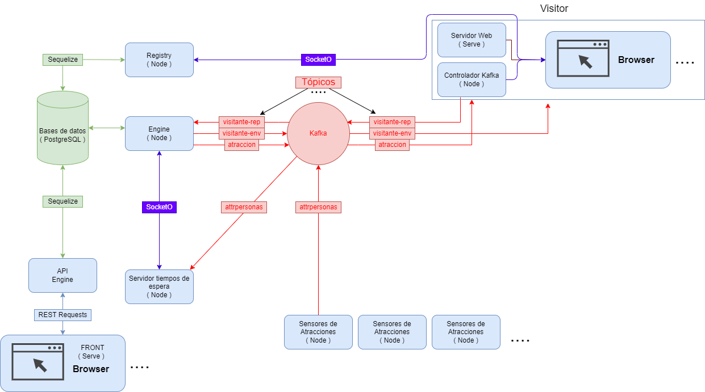

# Distributed Systems.

This repository contains the exercices that i've done during UA's Distributed Systems assignature, meant to learn distributed architectures, blockchain, interconnection of systems, front / backend tech, coordination between nodes, cloud computing and security algorithms.

You'll find here my practices, exercices and theory aswell.
