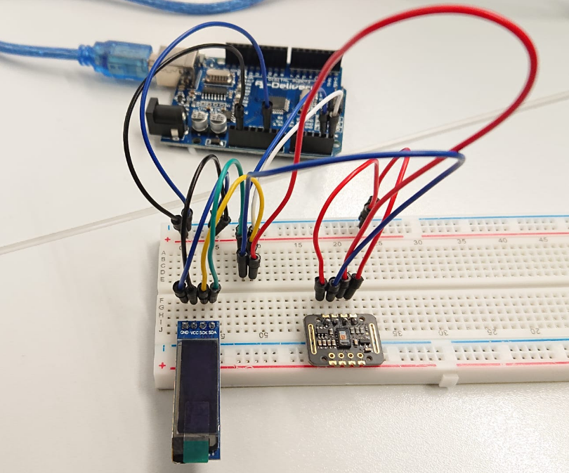

# Embedded Systems.

    

This repository contains the practices that i've done during UA's Embedded Systems assignature, using an Arduino NANO 33 Headers, and a Raspberry Pi.

You'll find here my practices, exercices and theory PDFs aswell.