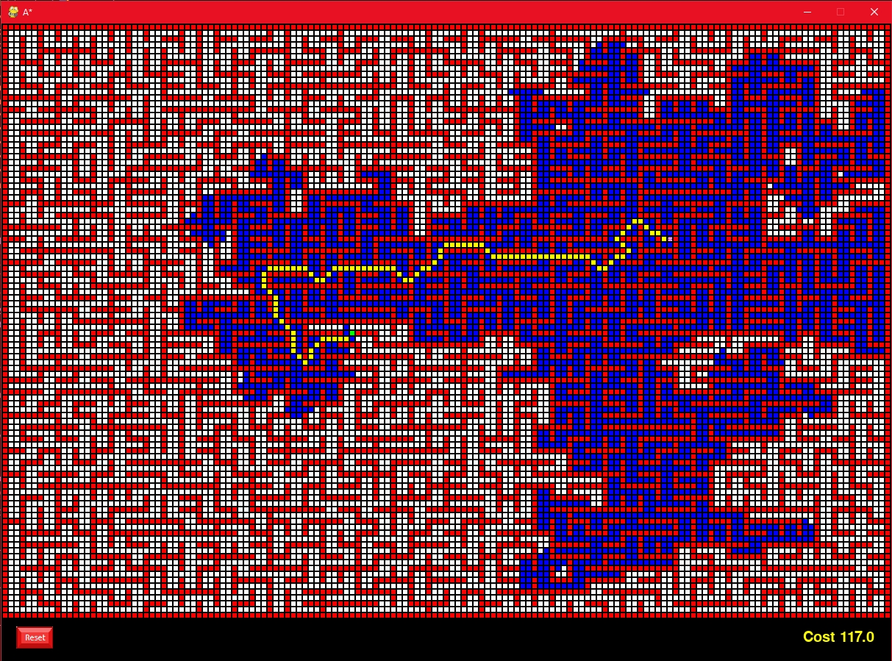

# Intelligent Systems

This repository contains the exercices that i've done during UA's Intelligent Systems assignature, meant to learn pathfinding algorithms such as A*, heuristics, AdaBoost, machine learning, object / vision detection algorithms and more.

You'll find here my practices, exercices and theory PDFs aswell.
