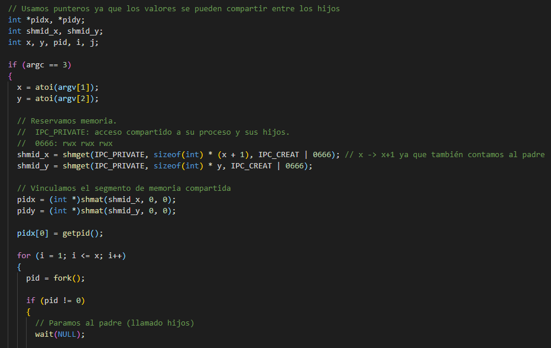

# Operating Systems

This repository contains the exercices that i've done during UA's Operating Systems subject, meant to learn the ins and outs of operating systems, forks, parents, signals, multiprocess syncronization etc, using a C++.